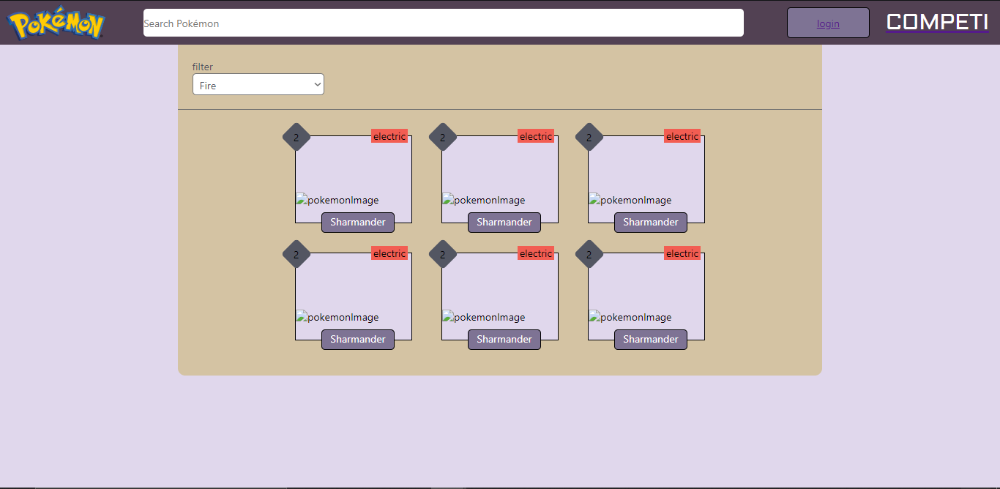

# Consumo de API Pokémon deasafio frontend

O arquivo contido neste repositório foi uma tentativa de desenvolvimento de uma interface com o objectivo de apresentar nomes, tipos, e número de qualquer pokémon, onde o usuário poderia pesquisar, e filtrar, pelo menos, por nome e tipo de pokémon que pretende ver, ou capturar (guardar em sua area de usuário), infelizmente não pude terminar o projecto, tive dificuldades de consumir a API (coisa fácil para quem está praticando mais hhhh), porém deixei a interface para ir fazendo.

## Requisitos para uso

* Deve ter instalado em sua máquina a versão mais estável do `Node Js` para te permitir instalar a versão mais recente do `Next Js`.
* Caso já tenha tudo isso instalado em sua máquina: 
1. Use o comando `$ git clone [url do repositório]`, ou pode usar `GitDesktop` que ele vai fazzer o download na sua pasta habitual;
    * Certifique-se que tenhas um editor de códigos, **VSCODE**, **Bracket**, são meus preferidos, **Notepad ++** também dá muito certo.
2. Estando em sua máquina, navegue até a pasta gerada pelo download, no windows `$ cd pasta`, é o padrão, *normalmente o nome será a frase que antecede a extensão .git, por exemplo: github/julino/compiteste.git, compiteste seria o nome da paste onte tem toda a aplicação*.
3. Tendo feito isto, **assumindo que tenhas o `Node Js` instalado**, instale as dependêcia chamando `$ npm install`;
4. Ele vai fazer todo o trabalho para você, depois só vai precisar verificar sem deu algum erro, ou alguma dependência precisa de atenção sua.
5. Feito isto, acessa o `packege.json`, neste arquivo você vai achar todos os scripts de como rodar a aplicação, lhe adianto já para que uses `$ yarn dev`, tiro e queda, e observe o `package.json`, para melhor conhecer as dependências que estão sendo usadas na aplicação.
6. Desse jeito, sinta-se a vontade para auterar o que quiser, é público.
7. Segue a minha imagem, não ficou muito legal, me visite mais tarde:

